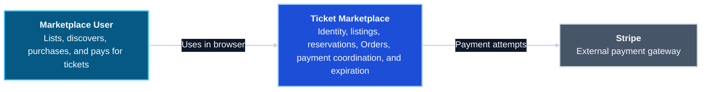

# C4 Level 1 — System Context

**Source of truth:** `../../service-boundary.md`

This level treats the entire ticket marketplace as one software system. The
React client and backend services are intentionally hidden until the container
diagram.

The diagram uses Mermaid flowchart layout to render the C4 context model with a
straight reading direction and explicit dark-theme contrast.

## Boundary decisions

- There is one user type. The same authenticated user may list and purchase
  tickets, including their own listing.
- The Ticket Marketplace owns application identity, listings, reservations,
  orders, and expiration decisions.
- Stripe is outside the application boundary and does not own Order state.
- Internal services, data stores, and the React client appear at C4 Level 2.
