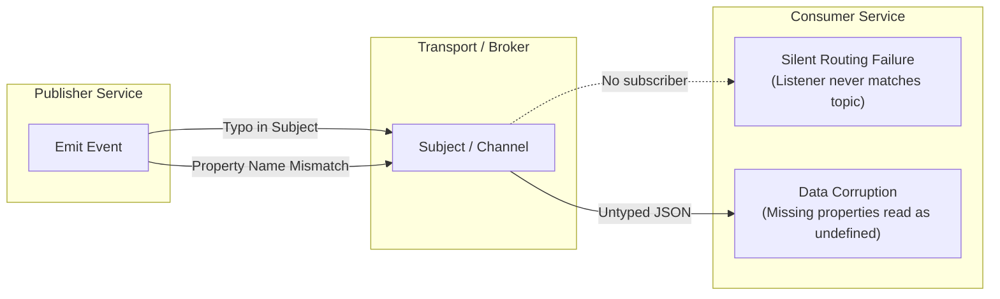

# Event Contracts and Deep Module Design in Event-Driven Systems

**Status:** System Design Architecture Guide  
**Applies to:** Cross-Service Asynchronous Communication (Tickets, Orders, Auth, Moderation)

---

## 1. Executive Summary

In distributed systems, microservices share neither memory nor databases. Cross-service state convergence relies on asynchronous messaging over channels or streams.

This document formalizes three non-negotiable architectural requirements:

1. **Strict Contract Enforcement:** Channel subjects and event payload schemas must be tightly bound at compile time and validated at runtime boundaries.
2. **Deep Module Infrastructure:** Messaging infrastructure must hide transport mechanics behind concise, deep interfaces so domain services only express business intent.
3. **Awaited & Safe Publication:** Event publication across service boundaries must be an awaited, guaranteed operation rather than an unmonitored background side-effect.

---

## 2. Distributed Failure Modes of Untyped Events

When services communicate via untyped message brokers, two catastrophic failure modes routinely undermine system reliability:



### Failure Mode 1: Silent Routing Failures (Subject Typos)

Message brokers route messages by string-matching subject/stream names. If a publisher publishes to `ticket:created` while a consumer listens to `Ticket:Created`:

- The broker does not reject the message.
- The consumer receives zero events.
- **Impact:** System state diverges silently with zero errors in application logs.

### Failure Mode 2: Property Guessing and State Corruption

If a publisher renames a field (e.g. `price` to `cost` or `title` to `name`), or if a consumer developer makes an unverified assumption about the payload:

- In dynamically typed runtimes (like JavaScript), accessing `data.cost` returns `undefined` without throwing an exception.
- The consumer writes `undefined` or default zero values into its database.
- **Impact:** Permanent data corruption across service boundaries that escapes automated smoke tests.

---

## 3. The Three Invariants of Event Contracts

To prevent silent failures, our event-driven architecture enforces three invariants:

### Invariant 1: Single Source of Truth for Channels

Channel and subject names are never written as raw strings inside business logic. They are maintained as centralized enumerations or frozen constant registries.

```ts
export enum Subjects {
  TicketCreated = "ticket:created",
  TicketUpdated = "ticket:updated",
  OrderCreated  = "order:created",
}
```

### Invariant 2: Literal Binding of Subject to Payload (The Event Contract)

Every event contract is a paired type where the subject is constrained to an **exact literal variant**, and the payload (`data`) is explicitly shaped:

```ts
export interface TicketCreatedEvent {
  subject: Subjects.TicketCreated; // Literal constraint
  data: {
    id: string;
    title: string;
    price: number;
    userId?: string;
  };
}
```

By linking `subject` and `data` in a single interface, generic listeners and publishers can use TypeScript's indexed access types (`T["subject"]` and `T["data"]`) to guarantee that specifying a subject automatically enforces the exact payload shape.

### Invariant 3: Explicit Immutability (`readonly`)

When implementing concrete listeners or publishers, subject properties must be declared `readonly`:

```ts
export class TicketCreatedListener extends Listener<TicketCreatedEvent> {
  readonly subject = Subjects.TicketCreated; // Prevents type widening to general Subjects enum
  // ...
}
```

This prevents TypeScript from widening the type to `Subjects` (which would allow any enum value) and guarantees alignment with the contract's literal requirement.

---

## 4. Deep Module Design in Messaging Infrastructure

Software complexity grows when callers must manage low-level mechanics. We adhere to John Ousterhout's principle of **Deep Modules**: *a module should provide a simple, narrow interface that hides substantial implementation complexity.*

```mermaid
flowchart TD
    subgraph Deep Infrastructure Module: Base Listener / Publisher
        I1["Promisifying raw driver callbacks"]
        I2["JSON serialization & parsing with error containment"]
        I3["Broker subscription options & durable naming defaults"]
        I4["Acknowledgment (ACK) dispatch & retry policies"]
        I5["Telemetry, tracing headers, and standard metrics"]
    end

    subgraph Surface Interface: Domain Class (3-5 lines)
        D1["Declare subject: readonly subject = Subjects.TicketCreated"]
        D2["Declare queueGroupName"]
        D3["Implement onMessage(data, msg) with pure business logic"]
    end

    Deep Infrastructure Module -->|Encapsulates all transport mechanics for| Surface Interface
```

### Separating Mechanism (Plumbing) from Policy (Business Logic)

| Concern | Where it Lives | Rationale |
| :--- | :--- | :--- |
| **Transport Plumbing** | Base Classes (`Listener`, `Publisher`) | Applies to every message regardless of business domain: promise wrapping, buffer decoding, error catching, ack waits. |
| **Business Policy** | Concrete Subclasses (`TicketCreatedListener`) | Specific to business rules: database queries, transactional locks, state machine transitions. |
| **Broker-Specific Overrides** | Configurable Hooks with Defaults | Expose simple override variables (e.g. `protected ackWait = 5000`) instead of complex parameter bags. |

---

## 5. Asynchronous Publishing and Transaction Boundaries

A common anti-pattern in event-driven microservices is "fire-and-forget" publishing:

```ts
// ❌ ANTI-PATTERN: Fire-and-forget publishing
app.post("/api/tickets", async (req, res) => {
  const ticket = await Ticket.create(req.body);
  
  // Not awaited! Callback ignored!
  client.publish("ticket:created", JSON.stringify(ticket));

  // Tells the client all is well, even if broker is offline:
  res.status(201).send(ticket);
});
```

### Why Publishers Must Be Awaitable (`async publish()`)

1. **Network Boundary Safety:** Emitting an event involves network I/O and disk write acknowledgment by the message broker.
2. **Consistent HTTP Responses:** An API endpoint must not return `201 Created` until either:
   - The message broker has acknowledged durable storage of the event, OR
   - The event has been durably stored in a local database Transactional Outbox table in the same transaction as the domain entity.
3. **Structured Error Handling:** A promisified publisher allows standard `try / catch` execution, enabling controllers to roll back or abort if publishing fails.

---

## 6. The Flexibility Boundary: Pragmatic vs. Speculative Design

When building shared base classes or messaging libraries, engineers often introduce excessive "speculative flexibility":

- Multiple layers of abstract factories.
- Configurable middleware pipelines with no current use case.
- Dynamic protocol switchers (e.g., preparing for Kafka when only NATS/Redis is used).

### The Golden Rule: Grounded Flexibility (YAGNI)

> **Build sensible defaults that solve 95% of use cases effortlessly, provide simple hooks for known variations, and write zero code for hypothetical future requirements.**

- **Sensible default:** Base listener automatically sets `manualAck: true` and `ackWait: 5000`.
- **Grounded hook:** If an analytics listener needs a 30-second window, it overrides `protected ackWait = 30000`.
- **Speculative debt avoided:** No `AckStrategyProviderFactory` or dynamic middleware chains.

---

## 7. Cross-Reference: From Educational Prototype to Production Architecture

| Architecture Stage | Reference Implementation | Production Implementation |
| :--- | :--- | :--- |
| **Exploratory Prototype** | [`nats-test/src/events/`](../../nats-test/src/events/) | NATS Streaming with generic TypeScript contracts, base classes, and manual ack. |
| **Production Commerce** | [`tickets/src/orders/`](../../tickets/src/orders/) & [`orders/src/workers.ts`](../../orders/src/workers.ts) | Redis Streams with Transactional Outbox publication, Zod schema validation at runtime boundaries, and `XAUTOCLAIM` recovery. |
| **Detailed Implementation Guide** | [`09-strongly-typed-event-pipeline.md`](../service-design/async-systems/09-strongly-typed-event-pipeline.md) | In-depth code walkthrough of generic types, indexed access, and async mechanics. |
