# Commerce Sequence Diagrams — Step 9

**Status:** Proposed design for review. This is not yet an accepted contract.

## Reading rules

- Orders, Tickets, and Identity are the backend business services. Payment, expiration, purchase recovery, and publication remain internal Orders capabilities.
- Orders DB and Tickets DB are separately owned. No transaction spans them.
- The local provider connection uses the Orders SQLite file through a separate connection and transaction boundary. It never joins an Order-state transaction.
- Redis is at-least-once transport, never a decision owner.
- Browser countdown is display-only. Backend deadlines and guarded state transitions are authoritative.
- Exact public and internal paths are stated below each diagram instead of inside Mermaid messages so the diagrams remain narrow and readable.

## 1. Successful purchase start

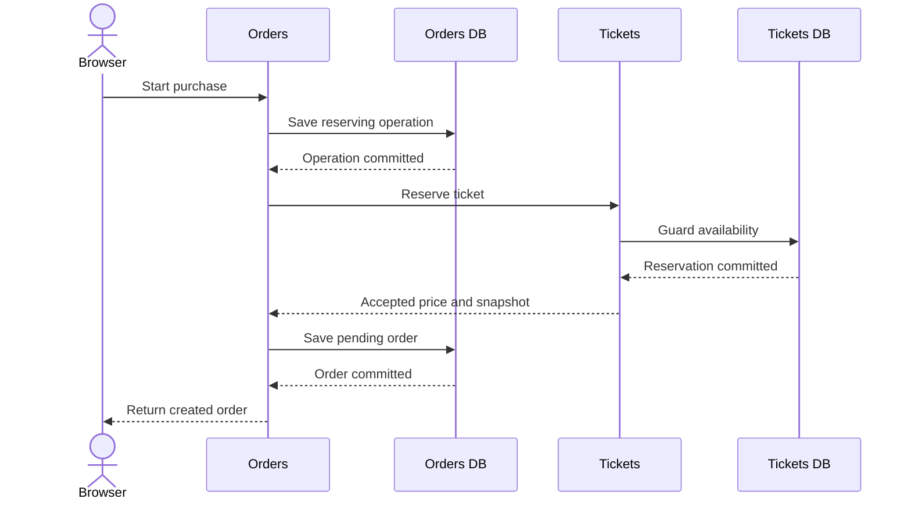

**Contract and invariant notes:** The browser uses `POST /orders` with `{ticketId}` and `Idempotency-Key`. Orders allocates the Order identity and fixed 15-minute deadline. Orders uses `PUT /internal/tickets/:ticketId/reservation` with `{orderId, expiresAt}` and the internal service token. Tickets commits `available -> reserved`, records exact `lockedByOrderId` and deadline, and returns authoritative price, currency, and immutable snapshot. Orders then commits the pending Order and completed purchase operation in one local transaction. No payable Order is returned earlier. Self-purchase follows the same path.

## 2. Two-buyer reservation race

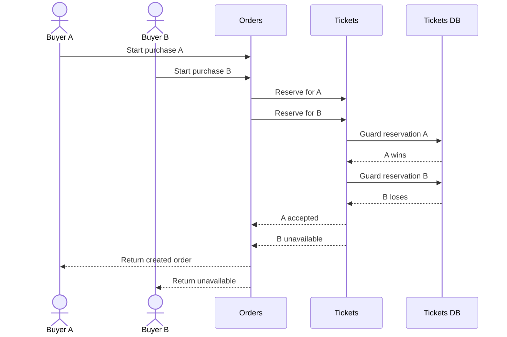

**Contract and invariant notes:** Each public request is `POST /orders` with its own key; each internal decision is the exact reservation `PUT`. The Tickets conditional write chooses one `available -> reserved` winner. Orders commits only the winner's pending Order and marks the losing operation rejected. The loser receives `409 ticket_unavailable` and no payable Order. Redis and stale reads play no role in choosing the winner.

## 3. Lost reservation response and exact recovery

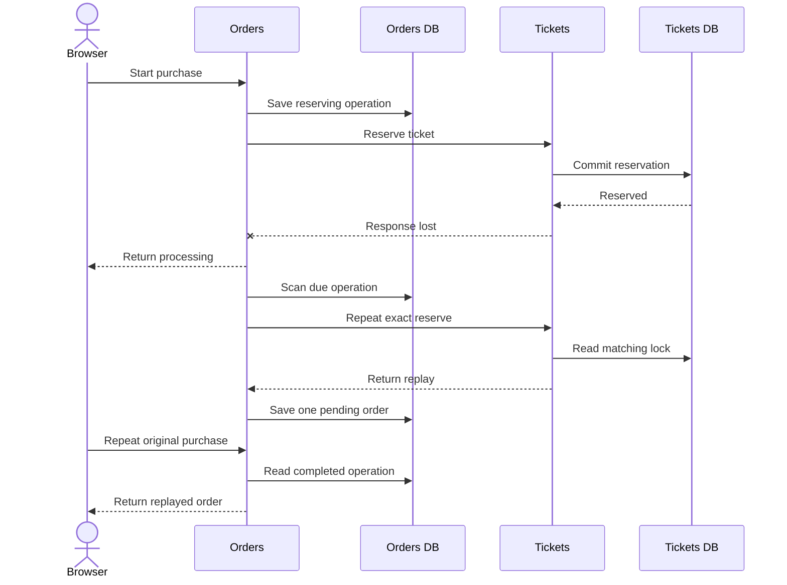

**Contract and invariant notes:** Tickets has committed the reservation, but the response and the Orders pending commit are absent. The public response is `202 processing` with `Retry-After`. Recovery repeats the same `PUT /internal/tickets/:ticketId/reservation` with the same Order identity and deadline, receives `200 replayed`, and commits one pending Order. The browser recovers only by repeating `POST /orders` with the same `Idempotency-Key`; `GET /orders/:orderId` cannot poll before an Order has been returned. The deadline never moves.

## 4. Incomplete purchase deadline and pre-Order release

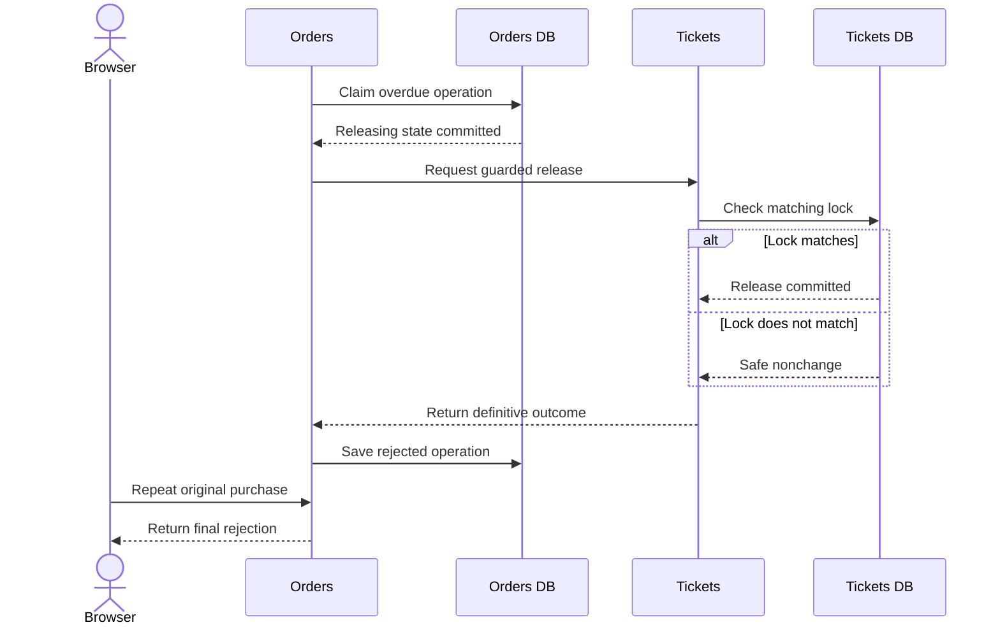

**Contract and invariant notes:** At the fixed deadline, a conditional Orders update changes `reserving -> releasing`; pending Order creation can no longer win. Orders uses `POST /internal/tickets/:ticketId/reservation/:orderId/release`. Tickets changes matching `reserved -> available` only when `lockedByOrderId` matches, otherwise returns one authoritative non-retry outcome. Orders records `rejected`; no Order exists. This direct release is only pre-Order recovery. Terminal completion and expiration convergence remain event-driven.

## 5. Immediate successful payment

### 5A. Eligibility, provider result, and local completion

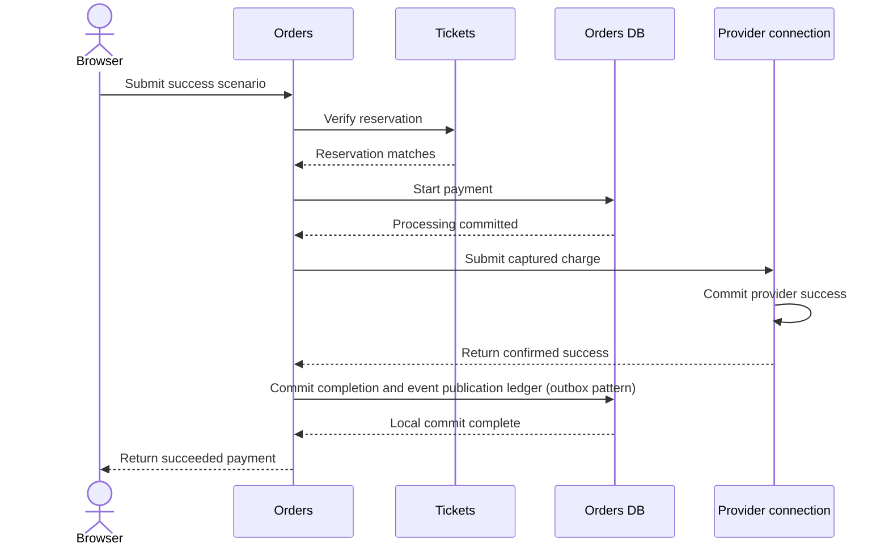

**Contract and invariant notes:** The browser uses `POST /orders/:orderId/payments` with `{paymentMethodToken: "local.success"}` and a payment key. Orders verifies ownership, pending status, backend deadline, and `GET /internal/tickets/:ticketId/reservation/:orderId` before provider submission. One Orders transaction changes `pending -> payment_processing` and inserts the processing Payment Attempt. The provider connection uses the same Orders SQLite file but a separate transaction boundary. A second Orders transaction changes Payment Attempt `processing -> succeeded`, Order `payment_processing -> complete`, and inserts `order.completed` v1 into the event publication ledger atomically.

### 5B. At-least-once completion convergence

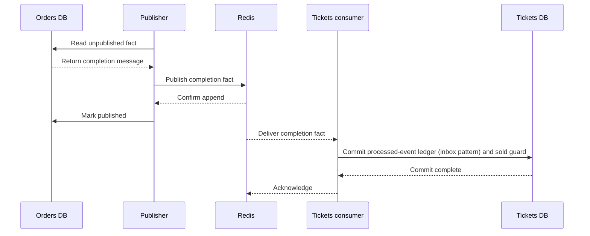

**Contract and invariant notes:** The publisher appends `order.completed` v1 to `orders.events` as one JSON envelope in field `event`, retaining the event publication ledger `messageId`. Tickets consumes through `tickets-order-convergence`. Its local transaction inserts the stable processed-event ledger marker and changes matching `reserved -> sold`, retaining the Order identity and clearing the lock deadline. ACK occurs only after commit. The payment response does not wait for this asynchronous convergence.

## 6. Confirmed decline with time remaining

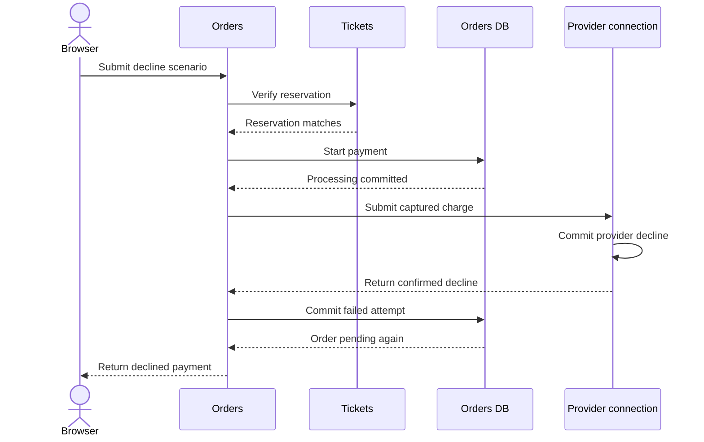

**Contract and invariant notes:** The public path is `POST /orders/:orderId/payments` with `local.decline`. The same eligibility and reservation checks apply. Before the deadline, the result transaction changes Payment Attempt `processing -> failed` and Order `payment_processing -> pending`. The Ticket remains reserved and no event publication ledger fact is created. A decline is a `200` observed outcome, not an error. A later attempt repeats all eligibility checks.

## 7. Processing payment succeeds after the displayed deadline

### 7A. Processing survives the deadline

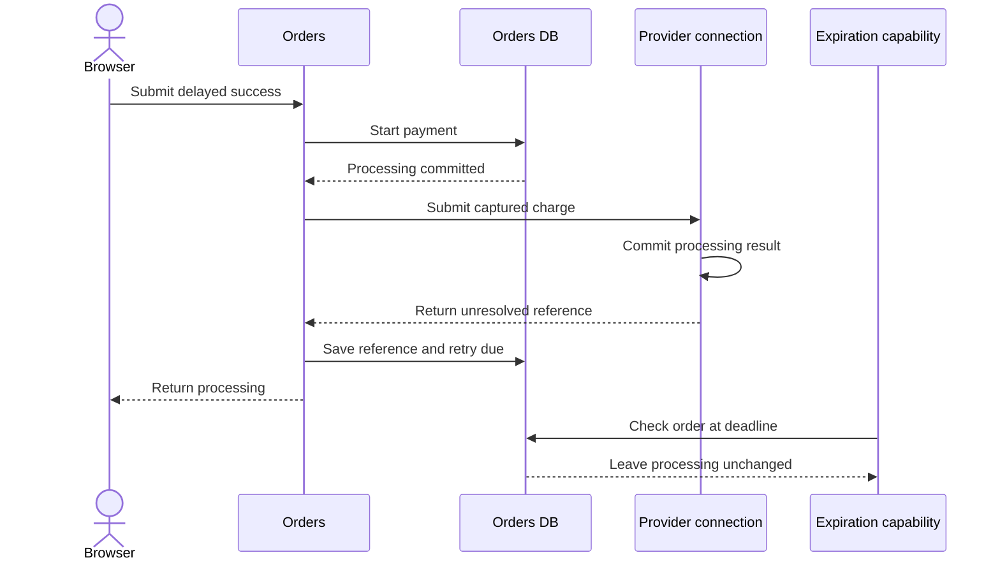

**Contract and invariant notes:** Before this sub-flow, Orders has verified `GET /internal/tickets/:ticketId/reservation/:orderId`. The public payment token is `local.processing-success`. Orders persists the safe provider reference and reconciliation due time, then returns `202 processing`. Browser display may reach zero, but expiration sees `payment_processing` and creates no expiration fact or Ticket release.

### 7B. Later provider success

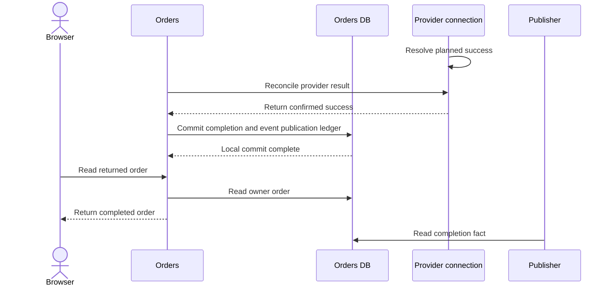

**Contract and invariant notes:** Provider resolution occurs in its separate transaction. Orders then changes Payment Attempt `processing -> succeeded`, Order `payment_processing -> complete`, and inserts `order.completed` v1 atomically. `GET /orders/:orderId` polls this already-returned Order. Event publication ledger publication and guarded sold convergence then follow diagram 5B.

## 8. Processing payment declines after deadline

### 8A. Processing remains protected until decline

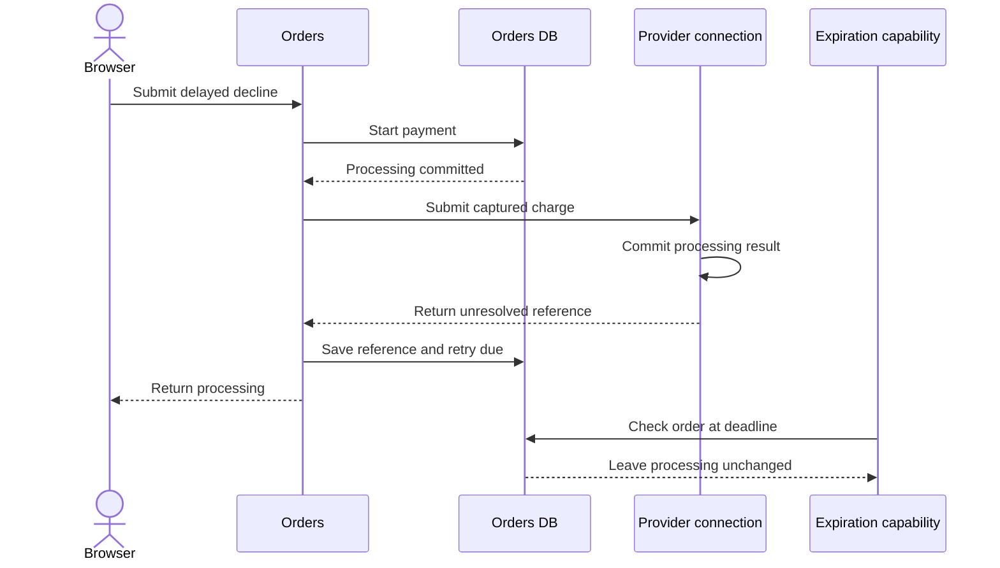

**Contract and invariant notes:** Before this sub-flow, Orders has verified the matching internal reservation. The token is `local.processing-decline`. The unresolved attempt remains durable and blocks ordinary expiration even after the browser countdown reaches zero.

### 8B. Confirmed late decline and release

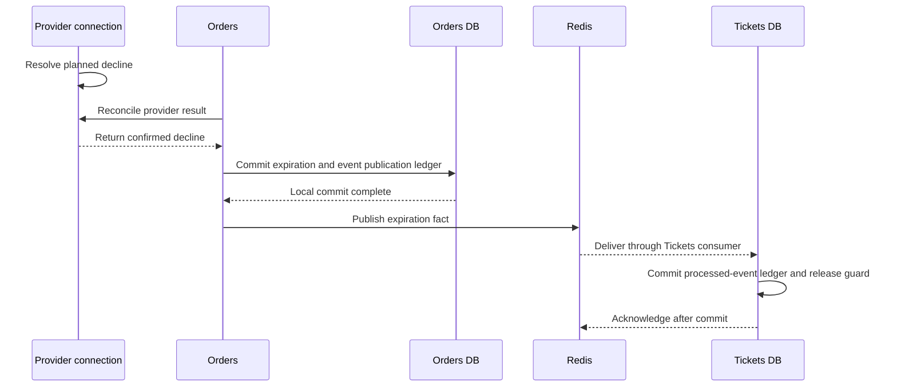

**Contract and invariant notes:** The Orders result transaction changes Payment Attempt `processing -> failed`, Order `payment_processing -> expired`, and inserts `order.expired` v1 atomically. The event publication ledger publisher, omitted as a participant to keep the diagram narrow, publishes to `orders.events`. The Tickets convergence capability consumes through `tickets-order-convergence`; its local transaction changes matching `reserved -> available`, clears both lock fields, and commits the processed-event ledger marker before ACK. `GET /orders/:orderId` later returns the expired non-payable Order.

## 9. Payment submission races pending expiration

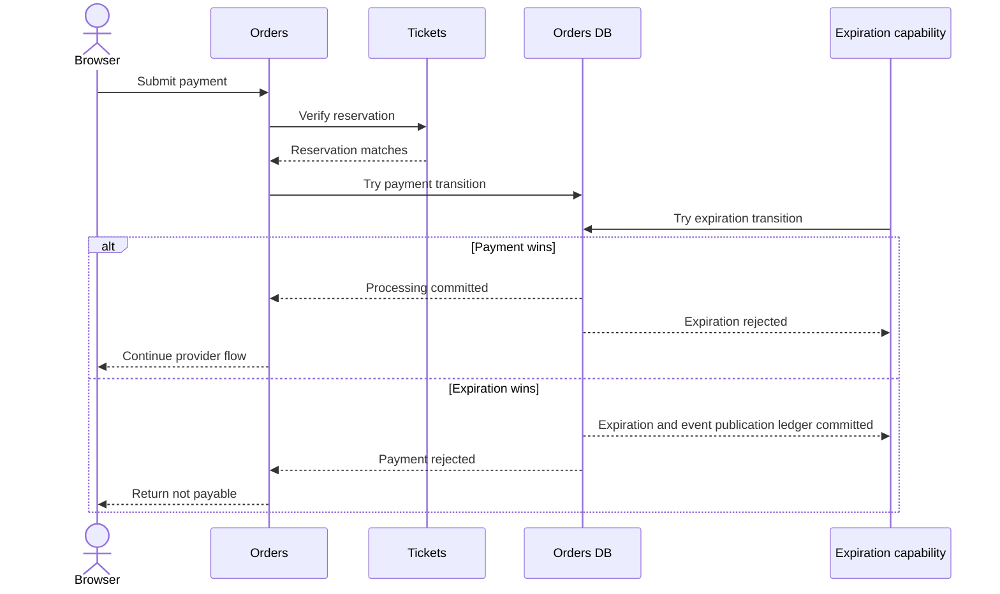

**Contract and invariant notes:** Both Orders decisions are conditional on current `pending` state and the backend deadline. If payment wins before the deadline, one transaction changes `pending -> payment_processing` and inserts the Attempt; expiration changes nothing and provider submission may proceed. If expiration wins, one transaction changes `pending -> expired` and inserts `order.expired` v1; no provider call occurs and payment returns `409 order_not_payable`. Reservation verification alone authorizes nothing.

## 10. Duplicate publication and commit-before-ACK redelivery

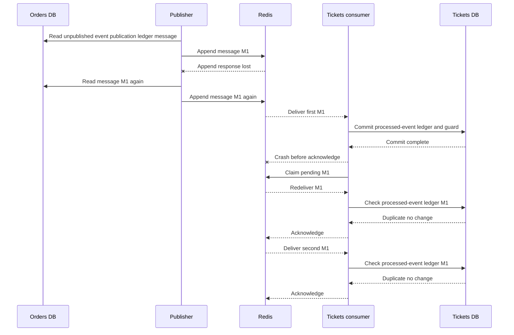

**Contract and invariant notes:** M1 is the same stable `messageId` for either accepted terminal fact. Event publication ledger retry may append it twice when append succeeded but publication progress did not commit. Consumer recovery uses pending inspection and `XAUTOCLAIM`; the abbreviated `Claim pending M1` message represents that exact operation. The stable Tickets processed-event ledger key suppresses both redelivery and duplicate append. Ticket mutation happens at most once.

## 11. Restart recovery from durable state

### 11A. Orders workers

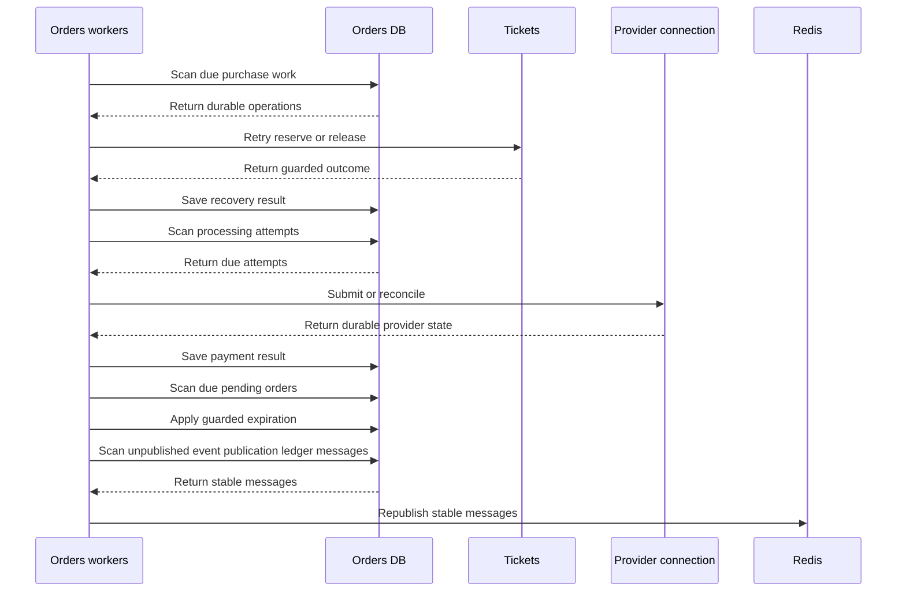

**Contract and invariant notes:** Startup and interval scans recover `purchase_operations`, processing Payment Attempts, due pending Orders, and unpublished event publication ledger rows. Reservation/release retries use the exact internal paths and stable identities from earlier diagrams. Provider retries use the stable provider idempotency identity. Expiration is conditional and inserts its event publication ledger fact locally. No process timer or prior instance memory is authoritative.

### 11B. Tickets pending recovery

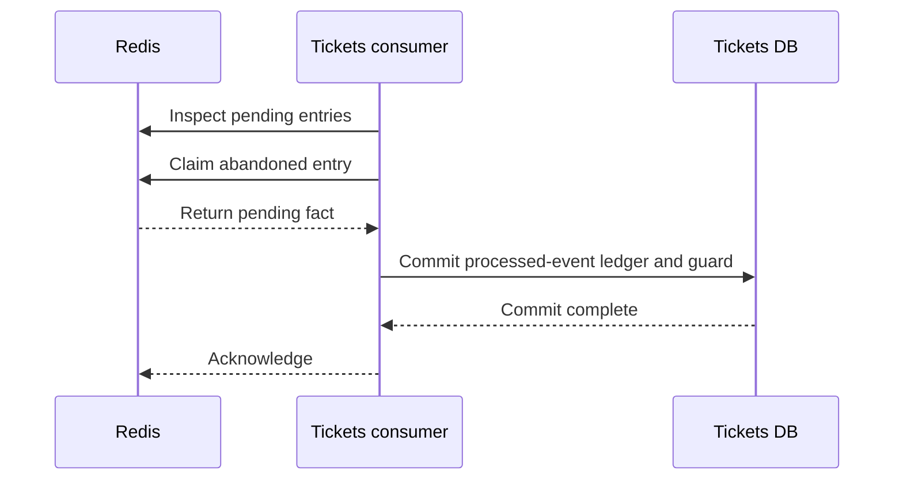

**Contract and invariant notes:** The consumer group is `tickets-order-convergence`; recovery uses `XAUTOCLAIM` with operational timing configured later. The current Ticket state and exact `lockedByOrderId`, not stream position, authorize sold or release.

## 12. My Orders and Order detail

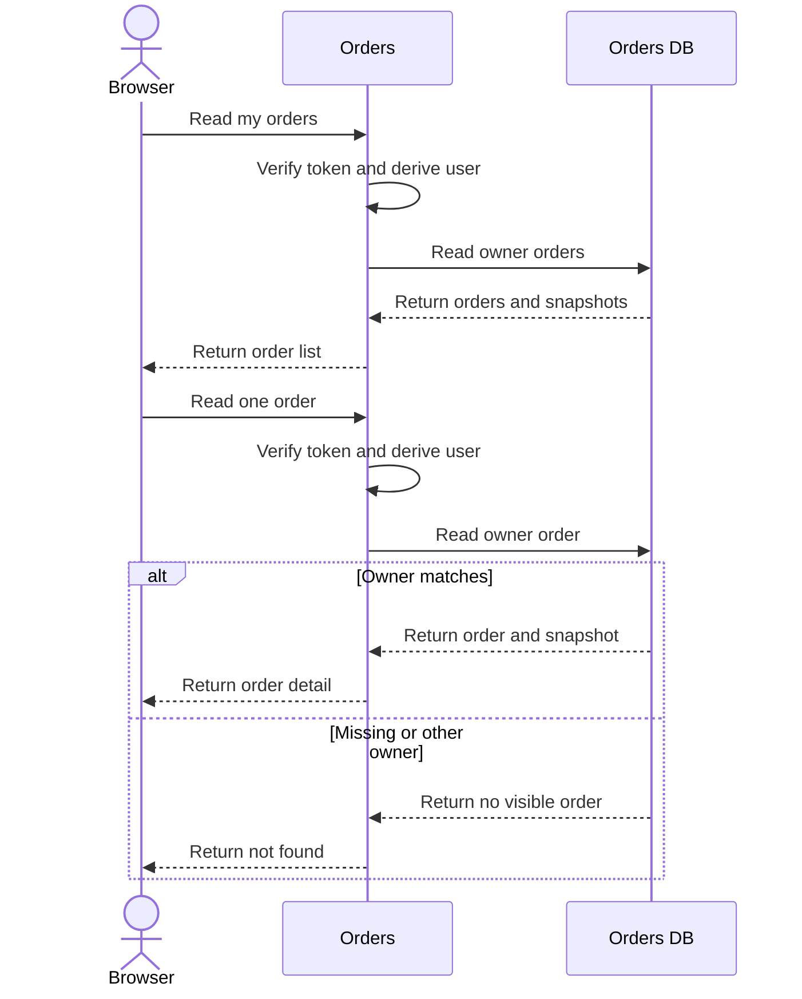

**Contract and invariant notes:** The exact paths are `GET /orders/mine` and `GET /orders/:orderId`. Orders independently verifies the Identity JWT and derives `userId`; it never calls Tickets to authorize either read. The immutable snapshot contains event name, start, optional end, place, and ticket information. Captured amount and snapshot never follow later Ticket edits. Another owner's Order is indistinguishable from missing.

## Cross-check matrix

| Diagram | Primary invariants and states | API contracts | Facts and recovery |
|---|---|---|---|
| 1 | TP-1 through TP-6 and TP-9 | Purchase POST and reservation PUT | No event |
| 2 | TP-2, TP-3, TP-7 | Two purchase POSTs and guarded reservation PUTs | No event |
| 3 | TP-4, TP-8, TP-9 | Exact reservation PUT replay and same-key purchase POST replay | Durable purchase recovery |
| 4 | TP-7, TP-8, EX-5 | Guarded pre-Order release POST | No terminal Order event |
| 5A and 5B | PAY-1 through PAY-4 and PAY-8 through PAY-10 | Payment POST and reservation GET | `order.completed` v1 and ACK-after-commit |
| 6 | PAY-1, PAY-2, PAY-5 | Payment POST and reservation GET | No terminal event |
| 7A and 7B | PAY-6, PAY-7, PAY-9 | Payment POST and Order GET | `order.completed` v1 after reconciliation |
| 8A and 8B | PAY-5 through PAY-7, EX-2, EX-5, EX-6 | Payment POST and Order GET | `order.expired` v1 and guarded release |
| 9 | EX-1 through EX-4 | Payment POST and reservation GET | Expiration fact only if expiration wins |
| 10 | PAY-3, PAY-8, EX-3, EX-5 | No public call | Same message identity, pending recovery, processed-event ledger suppression |
| 11A and 11B | TP-8, TP-9, PAY-6, EX-3, EX-6 | Exact internal retries where applicable | Unpublished event publication ledger and `XAUTOCLAIM` recovery |
| 12 | OH-1 through OH-6 | My Orders GET and Order detail GET | Read-only and no cross-service authorization |

## Final consistency notes

- The only committed facts are `order.completed` version 1 and `order.expired` version 1.
- Terminal sold and release convergence is asynchronous. Payment and expiration never use a synchronous terminal Ticket command.
- The sole direct release operation is guarded purchase recovery before a valid payable Order exists.
- Every database transaction is local to one owner. The provider connection has a separate transaction boundary even though its table is in the Orders SQLite file.
- No diagram transports raw card data, accepts browser-owned identity or money fields, or treats countdown display as state.
- No diagram adds a service, operation, fact, or persistence decision beyond Steps 4 through 8.
