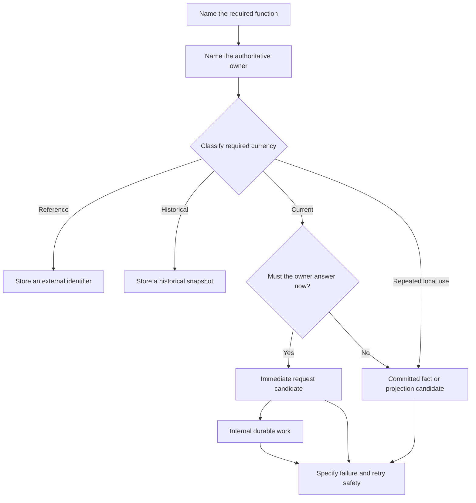

# Service-to-Service Communication Design Guide

**Purpose:** Provide a repeatable way to design communication from business
needs instead of starting with routes, events, queues, or framework choices.

Use this guide before adding an interaction to `communication.md`, `events.md`,
`api_contracts.md`, or a sequence diagram.

## First principles

1. Every business fact has one authoritative owner.
2. Copying data does not transfer authority.
3. Communication exists only because a business decision or observable result
   needs data owned elsewhere.
4. A current authoritative answer, a historical snapshot, and a committed fact
   are different needs.
5. Transport is selected after ownership, freshness, timing, and failure behavior
   are understood.
6. `common` is a shared package, not a runtime service. It may provide generic
   authentication and authorization mechanics, but it does not own business data
   or service-specific policy.

## The FACTS framework

Apply **FACTS** to each proposed interaction.

### F — Function

Name the exact business decision or page field that forces communication.

Bad:

```text
Moderation needs Ticket data.
```

Better:

```text
The administrator must see the Ticket description captured when the purchase
began.
```

If no specific decision or observable result requires the data, do not add the
interaction.

### A — Authority

Name the one service that owns the truth.

```text
User identity, email, role, account status -> Identity
Order ownership, state, captured purchase data -> Orders
Ticket ownership, listing data, availability -> Tickets
Report reason, evidence, review state, decision -> Moderation
```

A consumer may store an external identifier, historical snapshot, or local
projection. None of those copies may make an authoritative business decision on
behalf of the owner.

### C — Currency

Classify how current the consumer's value must be.

| Classification | Meaning | Example | Normal treatment |
|---|---|---|---|
| Local owned data | The consumer creates and controls the value | Report reason | Store locally |
| External identifier | Stable reference to another owner's entity | `orderId` | Store the identifier |
| Historical snapshot | Value copied at a named moment for evidence or history | Ticket description at purchase | Store and label the snapshot time |
| Current authoritative value | The latest owner-controlled value is required now | Current Ticket availability | Obtain an authoritative answer |
| Local projection | A possibly delayed copy supports local reads or enforcement | Banned-user projection | Update from committed owner facts |

A snapshot means “captured at a specific moment,” not merely “old.” A projection
may be useful and current enough for its purpose, but it is still not the owner's
database.

### T — Timing

Decide when the consumer must know the result.

| Timing requirement | Candidate interaction |
|---|---|
| The caller cannot safely continue without the answer | Immediate request and authoritative decision |
| The owner already committed and another service may react later | Asynchronous committed fact |
| One service accepted work that must survive restart or dependency outage | Internal durable work with retry |
| The value is needed only as historical evidence | Persisted snapshot |
| The value supports repeated local reads or enforcement | Local projection |
| Only a stable relationship is needed | External identifier |

These are candidates, not automatic choices. Failure semantics may show that a
candidate is unsafe.

### S — Safety

Specify behavior under the failures the transport will eventually expose.

For a request:

- What is a definitive business rejection?
- What is a temporary failure?
- Can the owner commit before the response is lost?
- How does the caller repeat the same logical request?
- Which identifier or idempotency key prevents duplicate work?

For an asynchronous fact:

- What authoritative state change committed before publication?
- What stable message identity suppresses duplicate application?
- What entity key defines ordering requirements?
- What happens when an older fact arrives after a newer state?
- When is the message acknowledged?
- How is pending or failed delivery recovered?

For a snapshot or projection:

- At what moment was it captured?
- May the value become stale?
- Is staleness safe for this use?
- Does the UI label historical values honestly?
- Which decisions must still return to the authoritative owner?

## Decision flow



Do not start with “REST or Redis?” Start with the top of this diagram.

## Communication card

Complete one card per interaction before naming a route or event.

```text
Interaction:

Business function:

Initiator:

Authoritative owner:

Required fields or decision:

Currency:
local | reference | historical snapshot | current authoritative | projection

Timing:
immediate | may arrive later | internal durable work

Success result:

Business rejection:

Temporary failure:

Unknown outcome:

Retry identity:

Duplicate behavior:

Out-of-order behavior:

Smallest safe data contract:

Data explicitly excluded:

Unresolved questions:
```

A card is ready for transport selection only when its owner, currency, timing,
and safety fields are concrete.

## Transport selection rules

### Prefer an immediate request when

- the caller needs the owner's current answer before continuing;
- a stale copy could authorize invalid work;
- the response is a decision rather than notification of a past decision; or
- the user needs a definitive success or business rejection now.

An immediate request does not require a remote Identity call merely to authorize
a JWT. Services verify signed access tokens locally. A remote call is justified
only when current Identity-owned business data is required.

### Prefer an asynchronous committed fact when

- the owner has already committed its state transition;
- downstream reactions may safely converge later;
- temporary consumer failure must not undo the owner's decision; and
- every consumer can handle duplicate, delayed, and late delivery.

Never use an event to ask who won a race or whether an action is currently
allowed.

### Prefer a historical snapshot when

- the value explains what happened at a past business moment;
- later edits must not rewrite evidence or financial history; and
- the consumer does not need the owner's current answer for the decision.

### Prefer a local projection when

- repeated reads or local enforcement should not fan out to another service;
- eventual consistency is safe for the specified action; and
- the projection consumer has explicit duplicate and ordering behavior.

## Boundary checks

Before accepting an interaction, confirm:

- No service reads another service's database.
- No generic “list every user/order/ticket” operation replaces a narrow business
  question.
- The browser does not supply trusted identity, ownership, state, money, or role.
- A copied field is labeled as reference, snapshot, or projection.
- The authoritative owner still rechecks any decision that requires current
  truth.
- The contract contains only fields required by the named function.
- Failure does not silently become empty data, rejection, success, or a second
  logical attempt.

## Worked moderation example

```text
Interaction:
Build the Ticket evidence shown during report review.

Business function:
Show the Ticket description as it appeared when the purchase began.

Authoritative owner:
Tickets originally owned the listing; Orders owns the immutable purchase
snapshot captured from the accepted Ticket.

Currency:
Historical snapshot.

Timing:
Needed during later administrative review, not as a current availability
decision.

Transport choice:
Read the immutable snapshot used by the Order and persist the required moderation
evidence. Do not fetch the current listing merely to render historical evidence.

Safety:
Later Ticket edits cannot rewrite the report evidence. Moderation labels the
value as purchase-time data and never uses it to authorize a new purchase.
```

This example removes a runtime Tickets dependency without moving Ticket authority
to Moderation.

## Review question

For every proposed field, ask:

> If this value is missing or stale, which business decision becomes unsafe?

If the answer is “none,” remove the communication or use a historical/local copy
instead of a live dependency.
