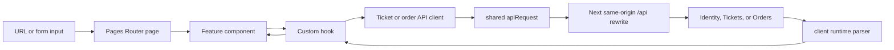

# Frontend Git-Diff Walkthrough

The frontend is a deliberately thin chain:

> **Pages Router → feature component → custom hook → API client → HTTP service**

A page chooses a screen, a feature component handles user-facing UI, a hook coordinates React state and timing, and an API client owns request details and response parsing. The browser proposes values; Identity, Tickets, and Orders validate and decide.

This guide describes the current implementation for a learner who knows some Python but is new to Next.js, React, and TypeScript. It focuses on one representative ticket-to-order path rather than listing every changed line. The companion [Order data capture pattern](../patterns/order-data-capture-pattern.md) follows the same data across service boundaries.

## 1. The layers

### Pages Router: filenames choose screens

The Pages Router maps files under `client/pages` to URLs:

- `pages/tickets/index.tsx` renders `TicketDiscovery` at `/tickets`.
- `pages/tickets/[ticketId].tsx` renders `TicketDetail` at `/tickets/:ticketId`.
- `pages/tickets/new.tsx` renders `NewTicket` at `/tickets/new`.
- `pages/tickets/mine.tsx` renders `MyTickets` at `/tickets/mine`.
- `pages/orders/index.tsx` renders `MyOrders` at `/orders`.
- `pages/orders/[orderId].tsx` renders `OrderDetail` at `/orders/:orderId`.

Dynamic route values are not ready on the first browser render. The dynamic pages therefore accept `string | undefined` from `useRouter().query`, keep only a single string, and pass `undefined` until the router is ready. A detail hook must not request `/tickets/undefined` or `/orders/undefined`.

Pages stay thin: they set document metadata, normalize route input, and render a feature component. They do not contain endpoint URLs or reservation logic.

### Feature components: UI and user actions

The ticket screens are split by responsibility in `client/features/tickets`: `TicketDiscovery`, `TicketDetail`, `TicketCard`, `NewTicket`, `MyTickets`, `OwnedTicket`, and shared `Feedback`. The order screens follow the same pattern in `client/features/orders`: `MyOrders`, `OrderCard`, `OrderDetail`, `Checkout`, `OrderCountdown`, and `OrderFeedback`.

Feature components:

- render loading, error, empty, and ready branches;
- read form fields and validate simple display/input relationships;
- call hook actions from submit and click handlers;
- navigate only after an action returns a real server result.

For example, `TicketDetail` disables “Start purchase” while the local action is processing and when the displayed ticket is not `available`. That is useful UX, not authorization. The server still re-checks availability and ownership when the request arrives.

### Hooks: state, effects, cancellation, and timing

The hooks in `client/hooks` are reusable stateful functions, not endpoints. Each file now owns one screen-level flow:

- `useTickets` loads filtered discovery results.
- `useTicket` loads one public ticket.
- `useMyTickets` loads owned inventory and applies authoritative price updates.
- `useCreateTicket` owns one create attempt and its idempotency key.
- `useOrders` loads the order list.
- `useOrder` loads one order and polls only while payment is processing.
- `useStartOrder` owns one purchase attempt, its `AbortController`, retries, and idempotency key.
- `usePayment` owns the selected provider token, payment state, and payment idempotency key.
- `useCountdown` updates a display-only number from an order deadline.

Effects load data after rendering and clean up timers or requests. A dependency array says which captured input creates a new loader: ticket ID, order ID, or a serialized filter request. This prevents both malformed requests and loaders that quietly use an older ID or filter.

### API clients: the HTTP vocabulary

`client/lib/api/tickets` and `client/lib/api/orders` split service calls into `queries.ts`, `commands.ts`, and `types.ts`; Orders also has `parsers.ts` for its custom result envelopes:

- ticket discovery becomes a query string; ticket detail URL-encodes its ID;
- starting an order sends `POST /api/orders/orders` with `{ ticketId }`;
- paying sends `{ paymentMethodToken }` to the order's payment endpoint;
- protected operations mark `protected: true` and supply an `Idempotency-Key` when the operation can be retried;
- every response is passed through a runtime parser before a hook stores it.

The shared `client/lib/api/request.ts` adds the Bearer header, includes cookies, turns non-OK responses into `ApiError`, and keeps JSON/FormData rules in one place. A `FormData` upload deliberately does not set `Content-Type`; the browser supplies the multipart boundary.



The browser talks to same-origin `/api/identity/*`, `/api/tickets/*`, and `/api/orders/*`. Next rewrites those paths to service URLs. The client does not import service code, and services do not trust TypeScript declarations from the browser.

## 2. One vertical trace: discovery → detail → start order

This is the main read-and-write path. Each step names the owner of the next decision.

1. **Discovery URL.** A user opens `/tickets?q=jazz&place=NYC`. `TicketDiscovery` reads `router.query`, converts valid fields into a `TicketFilters` object, and lets the browser keep the filter inputs as form values.
2. **Discovery hook.** `useTickets(filters, enabled)` makes a stable serialized filter key. Its effect calls `listTickets(filters)` only when the router is ready and the filters are valid.
3. **Public Tickets request.** The ticket client uses `URLSearchParams` to build `/api/tickets/tickets?...`. `apiRequest` fetches it; the Tickets service decides which listings are currently public and available.
4. **Runtime boundary.** `parseTicketPage` checks the response shape, pagination numbers, currency, and ticket statuses. Only the parsed `TicketPage` becomes `ready` hook state. The component maps tickets to `TicketCard` links.
5. **Detail route.** Clicking a card navigates to `/tickets/<id>`. `[ticketId].tsx` accepts one string and passes it to `TicketDetail`. `useTicket` waits if it is absent, then calls `getTicket(id)` and stores the parsed authoritative ticket.
6. **Start action.** The button's `available` check prevents an obviously stale click, but it does not reserve anything. `useStartOrder` captures the ticket ID and one UUID idempotency key for this logical attempt. `startOrder` sends the ID in JSON and the key in `Idempotency-Key`, with the access token added centrally.
7. **Orders decides.** Orders validates the authenticated user, ticket state, and reservation/order invariants. A `created` or `replayed` response contains an `Order`; a `processing` response is not treated as success yet. The hook may retry a processing response up to five total calls, waiting two seconds between calls and reusing the same key.
8. **Navigation follows server state.** On an order result, `TicketDetail` navigates to `/orders/<order.id>`. A 4xx business response is a rejection and clears the attempt key. Network failures, 5xx responses, or unresolved processing preserve the key so a retry can safely continue the same server operation. An abort (unmount, ticket change, or newer click) is separate from rejection; late work must not update the current screen.

The order response contains the captured amount and ticket snapshot used by the order UI. The client does not recompute a price from the current listing, and the detail page does not assume that a positive countdown makes an order payable.

## 3. Auth: browser and server have different boundaries

### Browser request example

The access token lives in the module-level memory of `client/lib/api/auth/session.ts`; it is not a durable cookie. The refresh token is an opaque `HttpOnly` cookie that browser JavaScript cannot read.

1. `pages/_app.tsx` calls `restoreAccessToken()` once after mount. Concurrent callers share the same in-flight refresh promise.
2. A protected API client calls `apiRequest`. It uses the in-memory token when present; otherwise it calls the same-origin auth helper at `/api/identity/refresh` with `credentials: "include"`, allowing the browser to send the refresh cookie.
3. `apiRequest` adds `Authorization: Bearer <access token>`. If the service returns `401`, it refreshes and retries the original request once. The original body and idempotency key are reused; a refresh is not a second business operation.
4. If authentication still fails, the client clears the in-memory token and sends the browser to `/auth`. Other errors remain `ApiError` values for the owning hook to classify.

Sign-in stores the returned access token in memory. Sign-out attempts the Identity request and clears local access state in `finally`, even when the network call fails.

### Server-side refresh example

`pages/index.tsx` uses `getServerSideProps`, so it runs in Next's server process. It cannot see the browser's in-memory access token. Instead, it passes `req.headers.cookie` to `refreshAuthenticationOnServer`, which:

- forwards the incoming `Cookie` header to Identity;
- parses the returned authentication payload;
- captures `Set-Cookie` and forwards it through `res.setHeader`;
- redirects to `/auth` when Identity returns no authentication.

This explicit Cookie/Set-Cookie handling is required for SSR. Do not replace it with a browser-only session helper or assume the server can read `HttpOnly` cookie contents directly. The remaining commerce pages load their data in the browser through the same-origin API paths.

## 4. One closure and idempotency example

A closure is a nested function that retains the values from the hook invocation that created it. Here the closure gives an action its ticket ID and its hook-local attempt record, while the ref keeps the key stable across re-renders:

```ts
function useStartOrder(ticketId: string) {
  const attempt = useRef<{ ticketId: string; key: string } | null>(null);

  async function start() {
    const current =
      attempt.current?.ticketId === ticketId
        ? attempt.current
        : { ticketId, key: crypto.randomUUID() };
    attempt.current = current;
    return startOrder(ticketId, current.key);
  }

  return { start };
}
```

The actual hook also owns an `AbortController`, limits processing retries, preserves the key through processing or temporary failure, and clears it after a definitive 4xx rejection. The important invariant is **one key per logical operation**: if a timeout leaves the outcome unknown, repeating that key lets Orders replay or continue the original operation instead of creating a second order. A key proves retry identity, not user identity, ownership, availability, or price.

Payment uses the same idea: the first selected provider token is locked together with one UUID key. During processing or temporary failure, a retry reuses both; a new token starts only after a definitive decline, success, terminal order status, or 4xx error.

## 5. Compact state and authority summary

| UI concern | Browser state and behavior | Authoritative rule |
|---|---|---|
| Ticket list/detail | `loading → error → ready`; reload repeats the read | Tickets owns listing fields, availability, and status (`available`, `reserved`, `sold`). |
| Start order | `idle`, `processing`, `temporary_failure`, or `rejected`; aborts stale work | Orders/Tickets atomically decide reservation and order creation. The button's disabled state is only a hint. |
| Order detail | `loading → error → ready`; displays the server's captured amount, snapshot, version, deadline, and status | Orders owns `pending`, `payment_processing`, `complete`, and `expired`. The client never marks an order expired or releases a reservation. |
| Payment | `idle`, `submitting`, `processing`, `declined`, or `error`; locks first token/key while unresolved | Orders owns payment coordination and terminal status. The response's updated order replaces local display state. |
| Processing poll | `useOrder` schedules a quiet two-second refresh only while status is `payment_processing` | A fresh Order ends polling. Cleanup cancels the timer when status, route, or component changes. |
| Countdown | `useCountdown` recalculates `expiresAt` every second and clamps display at zero | It is presentation only. A zero countdown does not authorize a client-side release or payment decision. |

Runtime parsers in `client/lib/api/commerce-types.ts` are another trust boundary: TypeScript types guide compilation, but HTTP data starts as `unknown` and must pass `parseTicket`, `parseOrder`, or `parsePaymentAttempt` before rendering.

## 6. Source map and caveats

- **Routes:** `client/pages/tickets/*`, `client/pages/orders/*`, `client/pages/_app.tsx`, and `client/pages/index.tsx`.
- **Ticket features:** `client/features/tickets/TicketDiscovery.tsx`, `TicketDetail.tsx`, `TicketCard.tsx`, `NewTicket.tsx`, `MyTickets.tsx`, `OwnedTicket.tsx`, and `Feedback.tsx`.
- **Order features:** `client/features/orders/MyOrders.tsx`, `OrderCard.tsx`, `OrderDetail.tsx`, `Checkout.tsx`, `OrderCountdown.tsx`, and `OrderFeedback.tsx`; `AppFrame` supplies shared page chrome.
- **Hooks:** Tickets uses `useTickets.ts`, `useTicket.ts`, `useMyTickets.ts`, and `useCreateTicket.ts`; Orders uses `useOrders.ts`, `useOrder.ts`, `useStartOrder.ts`, `usePayment.ts`, and `useCountdown.ts`.
- **HTTP clients:** `client/lib/api/tickets/{queries,commands,types}.ts`, `client/lib/api/orders/{queries,commands,types,parsers}.ts`, and shared `client/lib/api/request.ts`.
- **Auth:** `client/lib/api/auth/session.ts`, `request.ts`, `refresh.ts`, and `refresh-server.ts`.
- **Contracts:** `client/lib/api/commerce-types.ts` contains runtime parsers as well as TypeScript shapes.
- **Routing boundary:** `client/next.config.ts` owns same-origin rewrites; service URLs remain server configuration.

Keep these distinctions when extending the UI:

- Convert route/query values at the page or feature edge; do not pass `string | string[] | undefined` into an endpoint expecting one ID.
- Keep endpoint paths, headers, bodies, and parsers in API clients rather than embedding `fetch` in JSX.
- Use a stable idempotency key for retries of one logical create/start/pay action; never generate a new key merely because React rendered again.
- Treat browser checks, local state, countdowns, and disabled buttons as hints. Re-read the authoritative backend result after races, retries, payment processing, expiration, or stale navigation.
- Abort and clean up old work so a previous ticket/order screen cannot publish into a newer one, but do not confuse cancellation with a business rejection.
