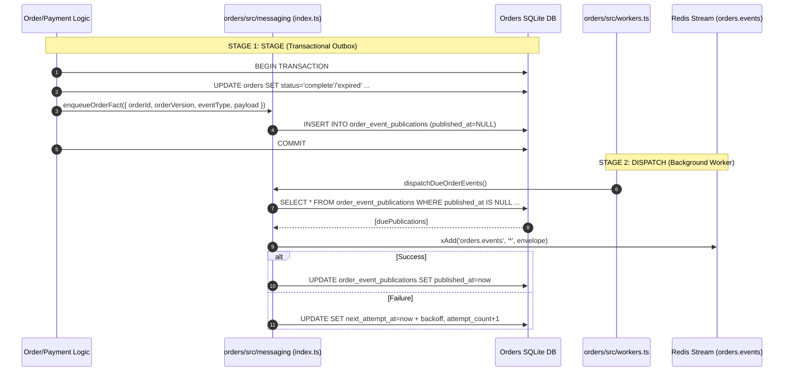

# Orders Messaging (Transactional Outbox)

The Orders service produces durable business facts (`order.completed`, `order.expired`) using the **Transactional Outbox** pattern.

> 📖 **Full System Guide**: See [`docs/messaging-architecture.md`](file:///c:/Users/User/publicprojects/MicroServices/stubhub/docs/messaging-architecture.md) for the end-to-end lifecycle between Orders and Tickets.

---

## How It Works in Orders

1. **Deep Module Boundary (`index.ts`)**
   - Callers express domain intent (`enqueueOrderFact`, `dispatchDueOrderEvents`, `closeOrderMessaging`).
   - Hides transport connection state, JSON serialization, envelope formatting, stream key names, and retry schedules.

2. **[STAGE 1: STAGE] Transactional Outbox Staging**
   - When an order transitions to `complete` or `expired` (in `order-repo.ts` or `payment-attempt-repo.ts`), an event publication is inserted into `order_event_publications` **in the exact same database transaction** via `enqueueOrderFact()`.
   - Ensures zero lost events even during abrupt server crashes.

3. **[STAGE 2: DISPATCH] Outbox Dispatcher**
   - Called by the background worker loop via `dispatchDueOrderEvents()`.
   - Polls due rows (`published_at IS NULL AND next_attempt_at <= now`).
   - Appends entries to Redis Stream `orders.events` using `XADD`.
   - On success, sets `published_at = now`.
   - On failure, increments `attempt_count` and applies exponential backoff in `next_attempt_at`.

4. **Transport Separation**
   - Redis is transport only; Orders' local SQLite database remains authoritative.

---

## File Map

- [index.ts](file:///c:/Users/User/publicprojects/MicroServices/stubhub/orders/src/messaging/index.ts): Deep module encapsulating outbox staging, SQL operations, retry backoff, and Redis Streams transport dispatch.
