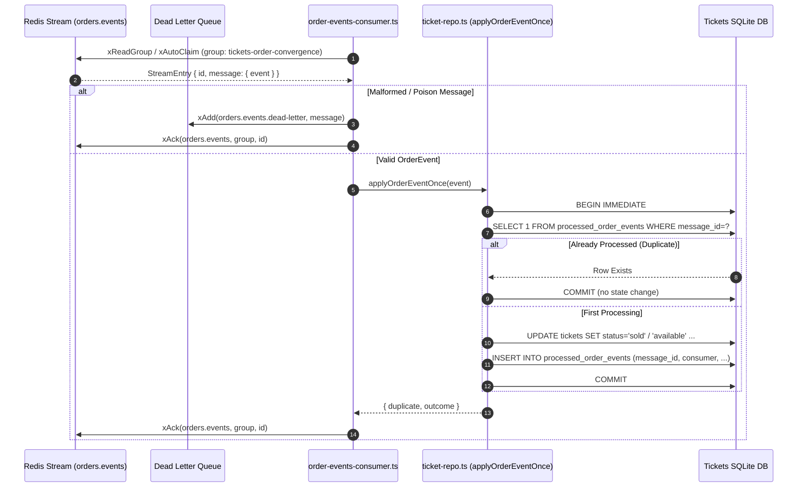

# Tickets Event Ingestion & Inbox Convergence

The Tickets service consumes durable business facts (`order.completed`, `order.expired`) produced by Orders via Redis Streams using the **Idempotent Inbox Ledger** pattern.

> 📖 **Full System Guide**: See [`docs/messaging-architecture.md`](file:///c:/Users/User/publicprojects/MicroServices/stubhub/docs/messaging-architecture.md) for the end-to-end lifecycle between Orders and Tickets.

---

## How It Works in Tickets
1. **Deep Module Boundary (`index.ts`)**
   - Entry point exposing `startOrderEventsConsumer(options?)` and `processStreamEntry(...)`.
   - Encapsulates Redis client setup, consumer group registration (`MKSTREAM`, `BUSYGROUP` handling), auto-generated consumer IDs, XAUTOCLAIM schedules, and graceful loop draining.

2. **[STAGE 3: INGEST] `order-events-consumer.ts`**
   - Connects to Redis and joins consumer group `tickets-order-convergence` on stream `orders.events`.
   - **Pending Recovery (`XAUTOCLAIM`)**: On startup and periodically, reclaims abandoned messages from crashed consumers.
   - **New Messages (`XREADGROUP`)**: Reads incoming entries with a blocking timeout.
   - **Poison Detection**: Validates schema with `orderEventSchema` (in `tickets/schemas.ts`). Malformed messages are immediately routed to `orders.events.dead-letter` and acknowledged with `XACK` to prevent poison crash loops.

3. **[STAGE 4: CONVERGE & ACK] `tickets/ticket-repo.ts::applyOrderEventOnce`**
   - Runs in a single SQLite `BEGIN IMMEDIATE` transaction:
     1. **Duplicate Check (Inbox Ledger)**: Checks table `processed_order_events` for `(message_id, consumer)`. If present, no-ops and commits.
     2. **State Convergence**: Transitions the Ticket:
        - `order.completed` $\rightarrow$ transitions `reserved` to `sold`.
        - `order.expired` $\rightarrow$ releases `reserved` back to `available` if `locked_by_order_id` matches.
     3. **Ledger Insert**: Records `(message_id, consumer, event_type, processed_at)` in `processed_order_events`.

---

## Key Files

- [index.ts](file:///c:/Users/User/publicprojects/MicroServices/stubhub/tickets/src/orders/index.ts): Deep module facade (`startOrderEventsConsumer`, `processStreamEntry`).
- [order-events-consumer.ts](file:///c:/Users/User/publicprojects/MicroServices/stubhub/tickets/src/orders/order-events-consumer.ts): Background stream consumer, group registration, claim loop, and poison dead-lettering.
- [schemas.ts](file:///c:/Users/User/publicprojects/MicroServices/stubhub/tickets/src/tickets/schemas.ts): Zod schema for incoming stream events (`orderEventSchema`).
- [ticket-repo.ts](file:///c:/Users/User/publicprojects/MicroServices/stubhub/tickets/src/tickets/ticket-repo.ts): Implements `applyOrderEventOnce` with the duplicate ledger check and Ticket state convergence.
